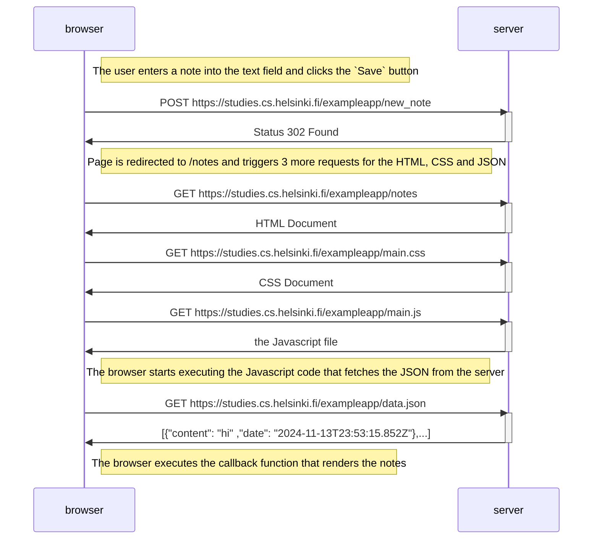

```mermaid
sequenceDiagram
    participant browser
    participant server

    Note right of browser: The user enters a note into the text field and clicks the `Save` button

    browser->>server: POST https://studies.cs.helsinki.fi/exampleapp/new_note
    activate server
    server->>browser: Status 302 Found
    deactivate server

    Note right of browser: Page is redirected to /notes and triggers 3 more requests for the HTML, CSS and JSON

    browser->>server: GET https://studies.cs.helsinki.fi/exampleapp/notes
    activate server
    server->>browser: HTML Document
    deactivate server

    browser->>server: GET https://studies.cs.helsinki.fi/exampleapp/main.css
    activate server
    server->>browser: CSS Document
    deactivate server

    browser->>server: GET https://studies.cs.helsinki.fi/exampleapp/main.js
    activate server
    server->>browser: the Javascript file
    deactivate server

    Note right of browser: The browser starts executing the Javascript code that fetches the JSON from the server

    browser->>server: GET https://studies.cs.helsinki.fi/exampleapp/data.json
    activate server
    server->>browser: [{"content": "hi" ,"date": "2024-11-13T23:53:15.852Z"},...]
    deactivate server

    Note right of browser: The browser executes the callback function that renders the notes
```
