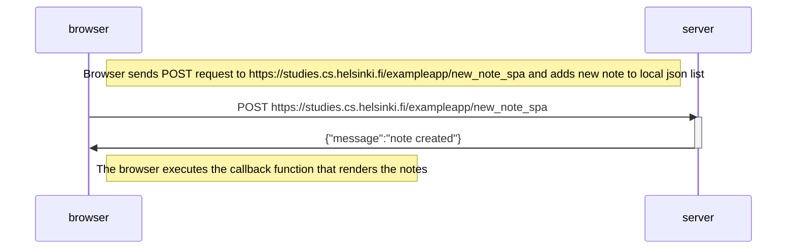

```mermaid
sequenceDiagram
    participant browser
    participant server

    Note right of browser: Browser sends POST request to https://studies.cs.helsinki.fi/exampleapp/new_note_spa and adds new note to local json list

    browser->>server:POST https://studies.cs.helsinki.fi/exampleapp/new_note_spa
    activate server
    server->>browser: {"message":"note created"}
    deactivate server

    Note right of browser: The browser executes the callback function that renders the notes

```